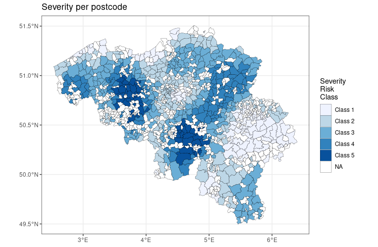

Load needed libraries. I wanted to use step.Gam (similar to stepAIC, but for GAMs), but unfortunately I just couldn't get it to work.
```{r, echo=FALSE, warning=FALSE}
library(mgcv)
library(classInt)
library(evtree)
library(readxl)

# install.packages("step.Gam")  
```

Read datasets, custom functions.
```{r}
load("../data/train.Rda")
postcodes = read_xls("../initial_docs/inspost.xls")

source("../r_utils/smooth_to_factors.r")
source("../r_utils/splits_evtree.r")
source("../r_utils/aic_evtree_alpha_and_depth.r")
```

The goal of this notebook is to bin our only continuous variable AGEPH, and to bin the spatial effects (Lon, Lat). As my main model will be the GLM, we will not focus too much on inference of the GAM models of this notebook. Rather, we will simply try to find the best model, then bin it.

Unlike the case in Roel Henckaerts, Katrien Antonio, Maxime Clijsters & Roel Verbelen (2018), from now on referred as SAJ-GAM, we only have AGEPH as our 'true' continuous co-variate. LAT&LON will automatically be grouped together in a bivariate smooth function. There is no need to search for interaction effects among continuous co-variates anymore, but we can search for interaction of categorical co-variates.

However I will not try to find for interactions for two reasons: I can't find a package that does mass model selection for GAMs, and it takes a while to compute a single GAM model. Besides, the true model is the GLM, this is just for binning.

We will follow SAJ-GAM's approach in firstly using BIC to select the best GAM candidate model, before then using AIC for the binning.

# Binning Frequency.

The model we end up with is *log(nbrtotc) = log(expo) + agecar + fuelc + split +fleetc + coverp + powerc + s(LAT, LONG) + s(AGEPH)*. The GAM model is called *gam5*.

## Finding a GAM model for frequency.

Let us try the most obvious one first, with all co-variates but no interaction terms. Note that it makes sense to compare likelihood based model-selection, since we are not altering the responses.

Seems like using thin-plates or cubics for AGEPH does not matter too much, but using TE for the spatial smoothers increases the likelihood by 57. This is bad news for model-selection, as we have 104740 observations in the trainset and thus a penalty/parameter of 11.5 if we use BIC. In other words, the models we picked with TE *might* have 5 less co-variates.

Though the difference is tiny in terms of likelihood, the model with cubic regression seems to perform better, so to simplify things we will work with cubic splines for AGEPH.
```{r}
# basic
f1 = nbrtotc ~ offset(log(duree)) + s(LAT, LONG, bs="tp") + s(AGEPH, bs="tp") + agecar + sexp + fuelc + split + usec + fleetc + sportc + coverp + powerc


# cubic splines for AGEPH
f2 = nbrtotc ~ offset(log(duree)) + s(LAT, LONG, bs="tp") + s(AGEPH, bs="cr") + agecar + sexp + fuelc + split + usec + fleetc + sportc + coverp + powerc

# te instead of tp for spatial
f3 = nbrtotc ~ offset(log(duree)) + te(LAT, LONG) + s(AGEPH, bs="cr") + agecar + sexp + fuelc + split + usec + fleetc + sportc + coverp + powerc

set.seed(0916778)  # so fitting can be reproduced without going through other steps
gam1 = gam(f1, family=poisson(link="log"), data=data, method="GCV.Cp")

set.seed(0916778)
gam2 = gam(f2, family=poisson(link="log"), data=data, method="GCV.Cp")

set.seed(0916778)
gam3 = gam(f3, family=poisson(link="log"), data=data, method="GCV.Cp")

print(paste("AIC of thin-plate(AGEPH) = ", round(gam1$aic, 1)))
print(paste("AIC of cubic(AGEPH) = ", round(gam2$aic, 1)))
print(paste("AIC of TE(spatial) = ", round(gam3$aic, 1)))

print(paste("Difference in BIC between cubic and thin-plate = ", round((gam1$aic - gam2$aic)*log(dim(data)[1])/2, 3)))
```

We haven't actually analyze the result of the GAM. Not much we can say about the smooth functions, since we do need them. On the other hand, it seems like *usec* and *sportc* can be dropped.
```{r}
summary(gam1)
```

Seems to confirm the previous hunch that *usec* and *sportc* can be dropped.
```{r}
anova(gam1)
```

Let us refit without *usec* and *sportc*. BIC drops, so that's good. Co-variate *sexp* seems to be a candidate to further drop.
```{r}
set.seed(0916778)
f4 = nbrtotc ~ offset(log(duree)) + s(LAT, LONG, bs="tp") + s(AGEPH, bs="cr") + agecar + sexp + fuelc + split + fleetc + coverp + powerc

gam4 = gam(f4, family=poisson(link="log"), data=data, method="GCV.Cp")
print(paste("BIC(gam1) = ", BIC(gam1)))
print(paste("BIC(gam4) = ", BIC(gam4)))
summary(gam4)
```

Dropping *sexp* again results in a drop of BIC. I don't even know the distribution used for the p-values, but looks like the remaining co-variates are significant. Another argument is that the multiplicative effects of remaining covariates are very strong here.
```{r}
set.seed(0916778)
f5 = nbrtotc ~ offset(log(duree)) + s(LAT, LONG, bs="tp") + s(AGEPH, bs="cr") + agecar + fuelc + split + fleetc + coverp + powerc

gam5 = gam(f5, family=poisson(link="log"), data=data, method="GCV.Cp")

print(paste("BIC(gam4) = ", BIC(gam4)))
print(paste("BIC(gam5) = ", BIC(gam5)))
summary(gam5)
```

Really it's a negligible difference but ok, we will stick with the cubic spline.
```{r}
set.seed(0916778)
f6 = nbrtotc ~ offset(log(duree)) + s(LAT, LONG, bs="tp") + s(AGEPH, bs="tp") + agecar + fuelc + split + fleetc + coverp + powerc

gam6 = gam(f6, family=poisson(link="log"), data=data, method="GCV.Cp")

print(paste("BIC(gam5) = ", BIC(gam5)))
print(paste("BIC(gam6) = ", BIC(gam6)))
```

Taking a look at the smooth functions. Interesting how in the 2d-plot you can see Brussels and Antwerp.
```{r, echo=FALSE}
par(mfrow=c(1, 2))
plot(gam5, scheme=2)
```


## Finding the spatial bins for frequency.

Preparing a dataframe for clustering. Interesting warning.
```{r}
# learnt the hard way that one has to supply all of the other terms in the formula
postcodes['duree'] = data[1, 'duree']
postcodes['AGEPH'] = data[1, 'AGEPH']
postcodes['agecar'] = data[1, 'agecar']
postcodes['fuelc'] = data[1, 'fuelc']
postcodes['split'] = data[1, 'split']
postcodes['fleetc'] = data[1, 'fleetc']
postcodes['coverp'] = data[1, 'coverp']
postcodes['powerc'] = data[1, 'powerc']
preds = predict.gam(gam5, newdata=postcodes, type="terms", terms=s(LAT, LONG))

clustering_df = as.data.frame(cbind(postcodes$LAT, postcodes$LONG, preds[, 7]))
names(clustering_df) = c("LAT", "LONG", "s_vals")
```

To bin the smoother, I will use Fisher's breaks, as in SAJ-GAM this was the best clustering algorithm for this use case. I will try out 3-10 clusters (later, it turns out I needed to check up to 20 clusters).

First we need to create the clusterings, and store them in the dataframe *fctr_rslts*.
```{r}
fctr_rslts = matrix(nrow=nrow(clustering_df), ncol=18)  # for storage
for (n_clusters in 3:20) {  # I can turn this to a function, but it's only used twice
  breaks = classIntervals(var=clustering_df$s_vals,
                          n=n_clusters, style="fisher")$brks  # get cluster breaks
  
  idx = n_clusters - 2
  resulting_clusters = smooth_to_factors(clustering_df,
                                         breaks,
                                         on_var="s_vals")$s_vals_binned
  fctr_rslts[, idx] = resulting_clusters
}
fctr_rslts = as.data.frame(fctr_rslts)
names(fctr_rslts) = paste("x", seq(3, 20), "clusters", sep="")
fctr_rslts[,"CODPOSS"] = postcodes$CODPOSS
head(fctr_rslts)
```

Prepare needed dataframe for below. I want to keep data "clean", so I make a copy of it.
```{r}
tmp = merge(data, fctr_rslts, by="CODPOSS", all.x=TRUE, all.y=FALSE)
for (col in names(tmp)[grepl("clusters", names(tmp))]) {
  tmp[, col] = as.factor(tmp[, col])
}
```


Now, we fit a GAM model for every single number of clusters. We first drop the smooth spatial function, then we create a loop where in each loop:
* We create a specific formula programatically, adding e.g. x7clusters as a covariate.
* We fit a GAM and store the AIC.

Initially I checked for 3 to 10 clusters. It is not true that increasing the number of clusters necessarily results in lower AIC, but in the initial run the minimum is at 10 clusters. Thus, I decided to expand the search to 20 clusters this time.
```{r}
base_formula = update(f5, ~. -S(LAT, LONG, bs="tp") )  # no longer needed

aic_results = rep(0, 18)
for (n_clusters in 3:20) {
  # need these to be able to create formulas programatically
  var = paste("x", n_clusters, "clusters", sep="")
  tmp_formula = update(base_formula, paste("~ . +", var))  # add as factor
  
  idx = n_clusters - 2
  
  set.seed(0916778)  # set seed again for easy reproducibility if needed
  aic_results[idx] = gam(tmp_formula, family=poisson(link="log"),
                         data=tmp, method="GCV.Cp")$aic
}

print(aic_results)
best = which.min(aic_results) + 2
print(paste("Best is", best, "clusters"))
```

Now we need to save the best-performing cluster. During subsequent analysis we can simply merge on *CODPOSS* to map postcodes into clusters.
```{r}
postcode_to_cluster = fctr_rslts[, c("CODPOSS", "x13clusters")]
# saveRDS(postcode_to_cluster, file="../data/freq_postcode_bins.Rda")
```


The clustering distribution.
```{r, echo=FALSE}
barplot(summary(as.factor(postcode_to_cluster[, "x13clusters"])))
```

With 13 bins I ought to take a look at the resulting binning. I made the image directly on the online notebook Dr. Antonio gave us. Looks pretty reasonable I would say, we can clearly see Brussels, Liege and Antwerp. Interesting that though Antwerp is clearly labeled as risky, it is not as risky as Brussels or Liege.


## Finding bins for *AGEPH* for frequency.

Set up the unique values of *AGEPH* present in the trainset, s(*AGEPH*), and the weights (counts of each age in the trainset).
```{r, warning=FALSE}
age_dat = data.frame(AGEPH=unique(data[, "AGEPH"]))

age_dat['duree'] = data[1, 'duree']
age_dat['agecar'] = data[1, 'agecar']
age_dat['fuelc'] = data[1, 'fuelc']
age_dat['split'] = data[1, 'split']
age_dat['fleetc'] = data[1, 'fleetc']
age_dat['coverp'] = data[1, 'coverp']
age_dat['powerc'] = data[1, 'powerc']
age_dat['LAT'] = 1
age_dat['LONG'] = 1

preds = as.data.frame(predict.gam(gam5, age_dat, type="terms", terms=s(AGEPH)))
age_dat[, "s_vals"] = preds[, "s(AGEPH)"]
age_dat = age_dat[, c("AGEPH", "s_vals")]

# freqs
freqs = plyr::count(as.factor(data[, "AGEPH"]))
colnames(freqs) = c("AGEPH", "Weights")
age_dat = merge(age_dat, freqs, by="AGEPH", all.y=FALSE, all.x=TRUE)
head(age_dat)
```

Clean up *tmp* from variables that we are not going to use.
```{r}
tmp = tmp[, c("agecar", "fuelc", "split", "fleetc", "coverp", "powerc",
              "x13clusters", "duree", "AGEPH", "nbrtotc")]
```


We will try this on a rather large grid first, later we will refine the grid. From previous experiments (not included), depths two and three are not interesting. Best alpha is at 150, but let us refine the grid and search for alpha in [130, 170].
```{r}
a_grid = c(seq(5, 50, by=5), seq(60, 100, by=10), seq(150, 600, by=50))
glm_formula = nbrtotc ~ agecar + fuelc + split + fleetc + coverp + powerc + x13clusters + AGEPH_binned + offset(log(duree))

aic_vals = aic_evtree_alpha_and_depth(gam_preds=age_dat, gam_var='AGEPH', 
                                      alpha_grid=a_grid, tree_formula=s_vals~AGEPH,
                                      glm_trainset=tmp, glm_formula=glm_formula,
                                      glm_family=poisson(), max_depth=c(4))
aic_vals
```

Trying it out on the finer grid. Looks like 150 is the idea value, so we will keep it.
```{r}
a_grid = seq(130, 170, by=5)
aic_vals = aic_evtree_alpha_and_depth(gam_preds=age_dat, gam_var='AGEPH', 
                                      alpha_grid=a_grid, tree_formula=s_vals~AGEPH,
                                      glm_trainset=tmp, glm_formula=glm_formula,
                                      glm_family=poisson(), max_depth=c(4))
aic_vals
```

We now need to save this result. I set a seed everytime the tree is fitted, so we can reproduce the exact fit.
```{r}
set.seed(0916778)

ctrl = evtree.control(minbucket=0.05*nrow(age_dat), maxdepth=4, alpha=150,
                      niterations=20000, ntrees=200)
tmp_tree = evtree(formula=s_vals~AGEPH, data=age_dat, weights=Weights, control=ctrl)
splits = splits_evtree(tmp_tree, age_dat[, "AGEPH"], data[, "AGEPH"])

age_df = data.frame("AGEPH"=seq(17, 100))
age_df = smooth_to_factors(age_df, splits, on_var="AGEPH")

# saveRDS(age_df, file="../data/freq_age_bins.Rda")
```


# Binning Severity.

Now, we just need to repeat the whole process, but for severity. However, we discussed in class that we condition severity on having at least one claim. This subset-ting below reflects that.
```{r}
sev_data = data[data[, "nbrtotc"] > 0, ]
nrow(sev_data)
```

I made a mistake and deleted *nbrtotan* (the average of claim amount, if any), so I will have to re-attach this.
```{r}
sev_data[, "avg_claim"] = sev_data[, "chargtot"] / sev_data[, "nbrtotc"]
```

We now need to fit in a GAM. Note that the model I ended up with is *log(avg_claim) = log(expo) + agecar + sexp + fuelc + split + fleetc + sportc + S(LAT, LONG) + s(AGEPH)*. The final GAM model is called *sev_gam2*.

## Finding a GAM model for severity.

Though the smooth functions aren't deemed as significant in terms of p-value, we can see from the plots that the two smooth functions can't be dropped. Plenty of candidates to drop, *coverp, usec, fleetc, sportc, powerc*.
```{r}
sev_f1 = avg_claim ~ offset(log(duree)) + agecar + sexp + fuelc + split + usec + fleetc + sportc + coverp + powerc + s(LAT, LONG, bs="tp") + s(AGEPH, bs="cr")
sev_fam = Gamma(link="log")
sev_gam1 = gam(sev_f1, sev_fam, data=sev_data)

summary(sev_gam1)
print("------------------------------------------------------------------")
anova(sev_gam1)
print("------------------------------------------------------------------")
par(mfrow=c(1, 2))
plot(sev_gam1, scheme=2)
```

After trying out various models by myself, I decided to drop *usec*, *coverp*, and *powerc*.
```{r}
sev_f2 = update(sev_f1, ~. - usec - coverp - powerc)
sev_gam2 = gam(sev_f4, sev_fam, sev_data)
summary(sev_gam2)
print("------------------------------------------------------------------")
anova(sev_gam2)
par(mfrow=c(1, 2))
plot(sev_gam2, scheme=2)
```


## Finding the spatial bins for severity. 

The codes in this subsection would almost be the exact same as the one for frequency.
```{r, warning=FALSE}
# ensuring all co-variates used in formulas are present
postcodes['duree'] = data[1, 'duree']
postcodes['AGEPH'] = data[1, 'AGEPH']
postcodes['agecar'] = data[1, 'agecar']
postcodes['sexp'] = data[1, 'sexp']
postcodes['fuelc'] = data[1, 'fuelc']
postcodes['split'] = data[1, 'split']
postcodes['fleetc'] = data[1, 'fleetc']
postcodes['sportc'] = data[1, 'sportc']
sev_preds = predict.gam(sev_gam2, newdata=postcodes, type="terms", terms=s(LAT, LONG))

sev_clustering_df = as.data.frame(cbind(postcodes$LAT, postcodes$LONG, sev_preds[, 7]))
names(sev_clustering_df) = c("LAT", "LONG", "s_vals")

# -----------------------------------------------------------------------------------------------

sev_fctr_rslts = matrix(nrow=nrow(sev_clustering_df), ncol=18)  # for storage
for (n_clusters in 3:20) {  
  breaks = classIntervals(var=sev_clustering_df$s_vals,
                          n=n_clusters, style="fisher")$brks  # get cluster breaks
  
  idx = n_clusters - 2
  resulting_clusters = smooth_to_factors(sev_clustering_df,
                                         breaks,
                                         on_var="s_vals")$s_vals_binned
  sev_fctr_rslts[, idx] = resulting_clusters
}
sev_fctr_rslts = as.data.frame(sev_fctr_rslts)
names(sev_fctr_rslts) = paste("x", seq(3, 20), "clusters", sep="")
sev_fctr_rslts[,"CODPOSS"] = postcodes$CODPOSS

# -----------------------------------------------------------------------------------------------

sev_tmp = merge(sev_data, sev_fctr_rslts, by="CODPOSS", all.x=TRUE, all.y=FALSE)
for (col in names(sev_tmp)[grepl("clusters", names(sev_tmp))]) {
  sev_tmp[, col] = as.factor(sev_tmp[, col])
}
```


GAM re-fitting, choice via AIC.
```{r}
sev_base_formula = update(sev_f2, ~. -S(LAT, LONG, bs="tp") )  # no longer needed

sev_aic_results = rep(0, 18)
for (n_clusters in 3:20) {
  # need these to be able to create formulas programatically
  var = paste("x", n_clusters, "clusters", sep="")
  tmp_formula = update(sev_base_formula, paste("~ . +", var))  # add as factor
  
  idx = n_clusters - 2
  
  set.seed(0916778)  # set seed again for easy reproducibility if needed
  sev_aic_results[idx] = gam(tmp_formula, family=sev_fam,
                         data=sev_tmp, method="GCV.Cp")$aic
}

print(sev_aic_results)
best = which.min(sev_aic_results) + 2
print(paste("Best is", best, "clusters"))
```

Seems like penalizing via AIC is not strong enough, so let us see with BIC instead. In hindsight, I should've stored every GAM model once fitted, then I can simply run BIC() over the stored models. 
```{r}
sev_bic_results = rep(0, 18)
for (n_clusters in 3:20) {
  # need these to be able to create formulas programatically
  var = paste("x", n_clusters, "clusters", sep="")
  tmp_formula = update(sev_base_formula, paste("~ . +", var))  # add as factor
  
  idx = n_clusters - 2
  
  set.seed(0916778)  # set seed again for easy reproducibility if needed
  sev_bic_results[idx] = BIC(gam(tmp_formula, family=sev_fam,
                         data=sev_tmp, method="GCV.Cp"))
}

print(sev_bic_results)
best = which.min(sev_bic_results) + 2
print(paste("Best is", best, "clusters"))

```

Even with BIC, the best is 18 clusters. I'm not willing to work with that many clusters, so I think I will limit the search into 10 clusters only. In reflection I should've realized this as well for the frequency gathering (imposing a strict "I want x many clusters maximum"), but alas, I'd rather not go back there.

With that said, the best is with 4 clusters only.
```{r}
which.min(sev_bic_results[1:8]) + 2
```

Distribution of the clustering.
```{r, echo=FALSE}
sev_postcode_to_cluster = sev_fctr_rslts[, c("CODPOSS", "x7clusters")]
saveRDS(sev_postcode_to_cluster, file="../data/sev_postcode_bins.Rda")

barplot(summary(as.factor(sev_postcode_to_cluster[, "x7clusters"])))
```

And here is the result of the spatial clustering for severity. A darker shade indicates higher risk.


## Finding bins for *AGEPH* for severity

Again, the code would for the most part be the same as for frequency.
```{r, warning=FALSE}
sev_age_dat = data.frame(AGEPH=unique(sev_data[, "AGEPH"]))

# ensuring all co-variates are present
sev_age_dat['duree'] = data[1, 'duree']
sev_age_dat['sexp'] = data[1, 'sexp']
sev_age_dat['agecar'] = data[1, 'agecar']
sev_age_dat['fuelc'] = data[1, 'fuelc']
sev_age_dat['split'] = data[1, 'split']
sev_age_dat['fleetc'] = data[1, 'fleetc']
sev_age_dat['sportc'] = data[1, 'sportc']
sev_age_dat['LAT'] = 1
sev_age_dat['LONG'] = 1

preds = as.data.frame(predict.gam(sev_gam2, sev_age_dat, type="terms", terms=s(AGEPH)))
sev_age_dat[, "s_vals"] = preds[, "s(AGEPH)"]
sev_age_dat = sev_age_dat[, c("AGEPH", "s_vals")]

# freqs
freqs = plyr::count(as.factor(sev_data[, "AGEPH"]))
colnames(freqs) = c("AGEPH", "Weights")
sev_age_dat = merge(sev_age_dat, freqs, by="AGEPH", all.y=FALSE, all.x=TRUE)

sev_tmp = sev_tmp[, c("agecar", "sexp", "fuelc", "split", "fleetc", "sportc",
              "x7clusters", "duree", "AGEPH", "avg_claim")]
```


Trying evtree binning on a large grid. Looks like *alpha* values between 10-30, *depth*=4 would be ideal, with the exact best being 10. Since this part of the grid is only a jump of 5 each, I won't re-partition the grid any further. Thus, I'll set *alpha* as 10.
```{r}
sev_glm_formula = avg_claim ~ agecar + sexp + fuelc + split + fleetc + sportc + x7clusters + AGEPH_binned + offset(log(duree))

a_grid = c(seq(5, 50, by=5), seq(60, 100, by=10), seq(150, 600, by=50))
sev_aic_vals = aic_evtree_alpha_and_depth(gam_preds=sev_age_dat, gam_var='AGEPH', 
                                      alpha_grid=a_grid, tree_formula=s_vals~AGEPH,
                                      glm_trainset=sev_tmp, glm_formula=sev_glm_formula,
                                      glm_family=sev_fam, max_depth=c(2, 3, 4))
sev_aic_vals
```

Saving the results.
```{r}
set.seed(0916778)

ctrl = evtree.control(minbucket=0.05*nrow(sev_age_dat), maxdepth=4, alpha=10,
                      niterations=20000, ntrees=200)
tmp_tree = evtree(formula=s_vals~AGEPH, data=sev_age_dat, weights=Weights, control=ctrl)
splits = splits_evtree(tmp_tree, sev_age_dat[, "AGEPH"], sev_data[, "AGEPH"])

sev_age_df = data.frame("AGEPH"=seq(17, 100))
sev_age_df = smooth_to_factors(sev_age_df, splits, on_var="AGEPH")

saveRDS(sev_age_df, file="../data/sev_age_bins.Rda")
```


